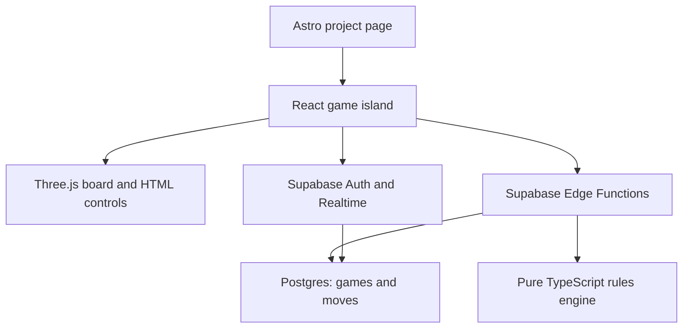

# 3D chess in the digital garden — implementation plan

**For Codex, 23 September 2026.** Repository: [the-evillevi/evillevi](https://github.com/the-evillevi/evillevi); site: [evillevi.pages.dev](https://evillevi.pages.dev/). Work in the existing repository and read its current instructions and code before editing. This is a two-player, online 3D chess game inside the garden, with **Strato Chess** and **Chess³** selectable when a game is created.

## Existing project and intended result

- The garden currently uses Astro 6, React 19, TypeScript, pnpm 11, Three.js, React Three Fiber and drei. It has an existing React/Three example in `src/components/affogato/` and a neobrutalist Catppuccin visual style.
- Projects are Astro content entries in `src/content/projects/`; the `/projects` portfolio and homepage read those entries. `src/content/projects/placeholder-project.mdx` occupies featured slot `order: 3`. The current `src/pages/projects/[id].astro` is a generic demo placeholder for entries with `demoPage: true`.
- Deliver a dedicated static Astro page at `/projects/3d-chess/` with a React island. Use `?game=<id>` for an existing match so static hosting needs no server-side route per game. Create a matching project content entry in slot 3 and remove the old placeholder entry when the playable page is ready. Link to the game from the portfolio and featured projects through the existing collection fields.
- A visitor can create a Strato or Chess³ game, share a link, join as the second player, and complete a legal match on three aligned 8×8 levels. Render pieces procedurally at first; imported 3D assets are optional. Give the user readable move history and a clear board-level indicator.

## Key rules decision before implementing moves

Keep the variants separate and versioned. Strato Chess and Chess³ share board dimensions, piece identities and turn mechanics; they **do not** share all move or attack rules. Do not implement a generic “3D chess” ruleset and attach two labels to it.

| Question | Strato Chess | Chess³ |
| --- | --- | --- |
| Primary reference | [Strato Chess demonstration](https://www.youtube.com/watch?v=B4ZybGdivzw) | [Published Chess³ description](https://www.chessvariants.org/3d.dir/chess-3.html) |
| Movement model to verify | Interlevel transfers and otherwise planar chess moves, with the first-move level-change condition and exceptions shown by the source | Piece-specific three-dimensional movement and capture geometry |
| Early test cases | Initial positions; first move of each piece; transfer versus capture; attacks and check; special castling | Initial positions; each piece’s movement across levels; blocking; cross-level capture; check |
| Source ambiguities to settle explicitly | Exact exceptions to forced level change, transfer constraints and castling sequence | Pawn promotion, castling, en passant and any diagram-only starting details |

**First milestone is a compact `docs/chess-rules.md`:** transcribe the relevant legal rules in original wording, cite the references, draw coordinate examples, document every ambiguity and choose a deterministic application convention where a source is silent. Record a `rules_version` per variant (for example `strato-v1` and `chess3-v1`) in every saved game. Have the game's owner approve interpretations before implementing irreversible rule-dependent persistence. If an ambiguity cannot be resolved from the source, state the chosen convention in the UI and tests. Do not describe it as a historical rule.

## Application shape



- Keep `src/lib/chess/` a pure TypeScript rules package with no browser, React, Astro, Node or Supabase imports. Its public operations should include `initialState(ruleset, version)`, `legalMoves(state, from)`, `applyMove(state, move)` and `status(state)`. Define level/file/rank coordinates, piece and move types, side to move, castling and en passant rights as applicable, and serializable position state. Implement separate `strato/` and `chess3/` movement/attack policies with shared state mechanics.
- Render with a `ChessApp` React island (`client:only="react"` if browser-only code requires it), R3F Canvas and drei controls. Three level planes should remain visible; let players focus/hide levels, rotate, zoom, select a piece, inspect legal destinations, and confirm moves. Keep game status, controls, rules summary and moves in HTML, with a selectable text-based move interface for keyboard/mobile accessibility. Avoid making a 3D click the only way to play.
- Use Supabase Auth for distinct players; anonymous sign-in is a workable low-friction start, with an optional later account-linking path. A creator receives a shareable invite URL and the joining user chooses the available side or is assigned it consistently. Define who can view a game before enabling spectators.
- Model `games` with `id`, `ruleset`, `rules_version`, player IDs, `status`, `position` (JSONB), `version` (monotonic integer), `turn`, timestamps and result; model `moves` with game ID, sequence/version, actor, move payload, resulting state hash/position data and timestamp. A persisted game never changes ruleset or version.
- The browser submits `{gameId, expectedVersion, move}` to an authenticated Edge Function. The function identifies the user, checks game membership, turn and ruleset version, computes a legal next state using the shared engine, then invokes a restricted Postgres function to atomically compare the old version, update the snapshot and append exactly one move. On a version conflict, fetch the latest game and let the user retry. Database permissions must prevent direct client writes to canonical positions, turn, result and move history.
- Add row-level security for reads and permitted lobby actions. Use Supabase Realtime Postgres Changes to notify each player of game updates, then refetch the authoritative snapshot; always refetch on reconnect or missed events. Keep service credentials confined to the server environment and use only public Supabase URL/anon or publishable key in the browser.

## Implementation passes

1. **Baseline and rules.** Clone/open the current `main` branch in Codex, check repository instructions, run `pnpm install`, `pnpm check`, and `pnpm build`, inspect existing routing, content schema, styling, CI and Cloudflare Pages settings. Write `docs/chess-rules.md` with source-backed rules and a table of resolved ambiguities. Capture representative opening positions and legal/illegal move examples for *both* variants. **Done when:** every exceptional rule needed for v1 has an explicit answer, a rules version, and testable examples.
2. **Rules engine.** Implement immutable serializable state, move generation, attacked squares, king safety, legal moves, turns, check/checkmate/stalemate, promotions and the special moves specified in the rules document. Add focused fixtures for every piece, three-level obstruction, capture/transfer, king exposure, each variant's exceptions and terminal states. Keep v1 state round-trip serialization stable. **Done when:** fixtures demonstrate the material differences between the two rulesets and illegal moves are rejected independently of the UI.
3. **Local game and 3D interface.** Add `src/pages/projects/3d-chess/index.astro`, `src/components/chess/ChessApp.tsx` and board/control components. Wire a local two-side practice mode to the engine so rendering and interaction can be checked before networking. Match garden colors, borders and typography; handle mobile viewport, loading and reduced motion. **Done when:** a complete local game can be played in each variant with visual move feedback, move list, board orientation and keyboard-accessible controls.
4. **Supabase persistence and security.** Add reproducible migrations and RLS policies under `supabase/migrations/`, Edge Functions under `supabase/functions/`, generated/shared types and `.env.example` with key names only. Implement create game, join game and submit move; enforce membership, single occupancy per color, legal moves and optimistic versioning server-side. Include a transaction/concurrency test: two moves from one position cannot both commit. **Done when:** a fresh Supabase environment applies the migrations and a hostile browser cannot set the board state or join as both players.
5. **Online match flow.** Connect the island to sign-in, invite links, game snapshots and Realtime. Handle stale versions, disconnect/reconnect, waiting for a friend, game completion, resignation and a mutually agreed draw if covered by the v1 product spec. A game should display both players and the locked ruleset with a short explanation. **Done when:** two independent browser sessions on different devices can play either variant to a recorded result; refreshing either browser restores the same position and history.
6. **Garden integration and release.** Replace `src/content/projects/placeholder-project.mdx` with `src/content/projects/3d-chess.mdx` using `order: 3`, `featured: true`, `liveUrl: "/projects/3d-chess"`, accurate tech and description, and a short deep dive on rules and architecture. Because a dedicated static page exists, do **not** set `demoPage: true` on this entry; reserve that flag for the generic `[id].astro` demo route. Verify homepage card, project deck, game page, metadata, navigation and the existing Affogato experience. Run `pnpm check`, `pnpm build`, engine/integration tests and a two-browser smoke test against the deployed environment. **Done when:** the game is reachable through the garden, both variants work online and production configuration is documented.

## Suggested file boundaries

```text
docs/chess-rules.md
src/pages/projects/3d-chess/index.astro
src/content/projects/3d-chess.mdx
src/components/chess/ChessApp.tsx
src/components/chess/Board3D.tsx
src/components/chess/GameControls.tsx
src/lib/chess/{types,state,engine}.ts
src/lib/chess/strato/*
src/lib/chess/chess3/*
src/lib/supabase/*
supabase/migrations/*
supabase/functions/{create-game,join-game,submit-move}/*
.env.example
```

Adjust names to the repository's conventions. In particular, decide how Edge Functions import the shared pure TypeScript engine in the installed Supabase runtime; verify this with a local function test before treating the engine as shared. Keep persistence and UI types derived from one versioned schema.

## Release boundary and follow-ups

The first public release needs private friend invites, two rulesets, validated legal play, reconnect, game result, accessible controls and a clear rules link. Textures, animated piece assets, clocks, matchmaking, ranked accounts, analysis and spectators can follow. Document any intentionally omitted draw or special-move behavior in the v1 rules page and game creation screen before launch.

## Paste into Codex to start

> Work in `the-evillevi/evillevi` on a feature branch. Implement the plan in `3d-chess-garden-plan.md` in the stated passes, starting by inspecting the current repository and writing `docs/chess-rules.md` for Strato Chess and Chess³. The game belongs on `/projects/3d-chess/` in the existing Astro garden, with React Three Fiber and Supabase. Keep the rulesets versioned and separate. Show me the resolved rule ambiguities and the resulting fixture examples before implementing the rules engine. Then implement, test and integrate the playable site incrementally, reporting each pass and any deployment configuration I need to supply.

## Source links

- [Garden repository](https://github.com/the-evillevi/evillevi)
- [Strato Chess video](https://www.youtube.com/watch?v=B4ZybGdivzw)
- [Chess³ published description](https://www.chessvariants.org/3d.dir/chess-3.html)
- [Astro framework components and hydration](https://docs.astro.build/en/guides/framework-components/)
- [Supabase row-level security](https://supabase.com/docs/guides/database/postgres/row-level-security)
- [Supabase Edge Function auth](https://supabase.com/docs/guides/functions/auth)
- [Supabase Realtime Postgres Changes](https://supabase.com/docs/guides/realtime/postgres-changes)
