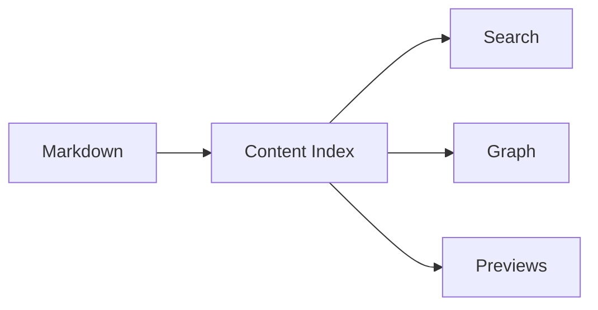

This site is a personal blog and knowledge base with a deliberately tactile interface. It keeps the writing model simple: Markdown and MDX live in content collections, while the interface adds search, backlinks, and previews around the text.

The important idea is that notes can point at one another. This post links to [[graph-garden|the graph garden note]] and the [[docs/setup/getting-started|setup guide]]. Those links become normal internal anchors at build time, but they also feed backlinks, previews, and the graph.

## Math and Diagrams

Inline math works with KaTeX: $E = mc^2$.

Block math works too:

$$
\int_0^1 x^2 dx = \frac{1}{3}
$$

## Why Neobrutalism

The design borrows the project showcase's Catppuccin tokens, hard shadows, square corners, and thick borders. It should feel closer to a desk full of labeled cards than a glossy content feed.
